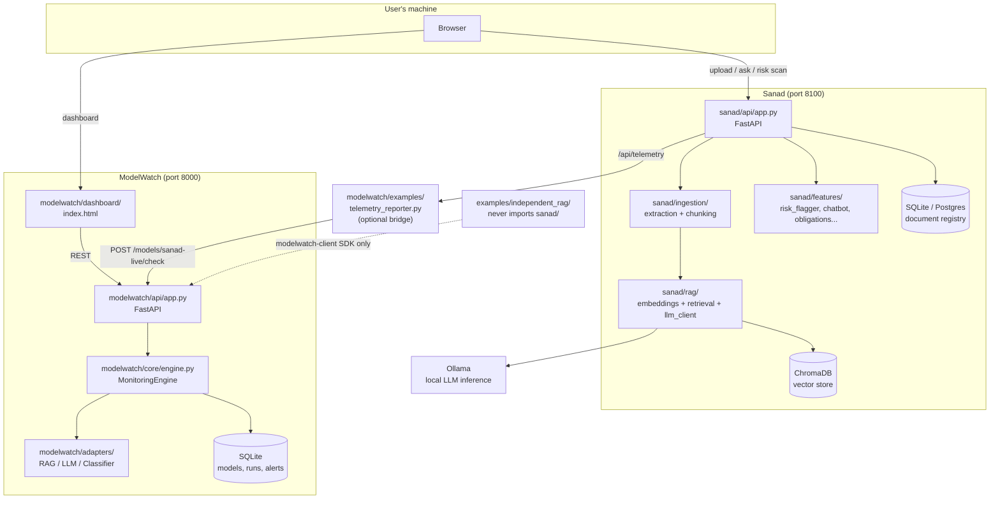
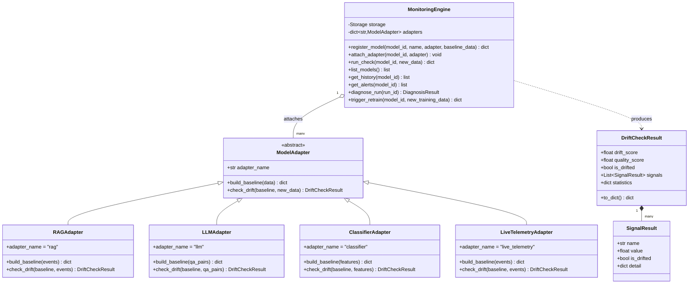
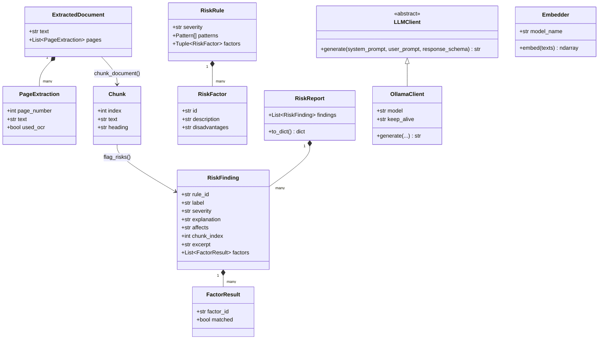
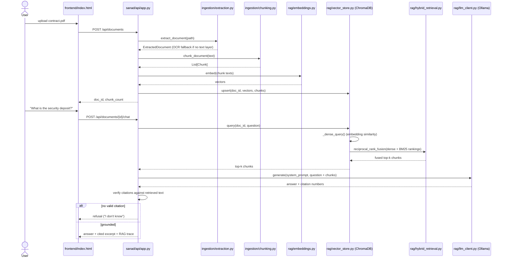
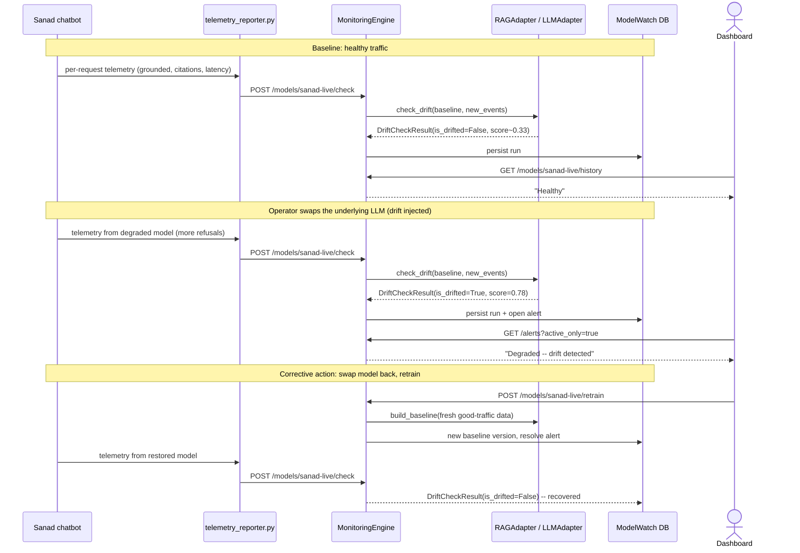

# Diagrams

Every diagram below is drawn from the actual class/function names in this
repo (see the file path noted under each one), not a conceptual sketch --
if a name here stops matching the code, the diagram is stale and should be
fixed, not the other way around. Rendered natively by GitHub; view locally
with any Mermaid-compatible Markdown viewer if needed.

## 1. System architecture

Two independently-runnable services plus Ollama, wired together by one
optional bridge process. `shared/jobs.py` is used by both apps but neither
app depends on the other's package.

## 2. Class diagram -- ModelWatch's adapter pattern

The one seam the monitoring engine is allowed to depend on
(`modelwatch/core/adapter_base.py`, `modelwatch/core/engine.py`,
`modelwatch/adapters/*.py`). `MonitoringEngine` never branches on model
type; every model-specific statistic lives in a concrete `ModelAdapter`.

## 3. Class diagram -- Sanad's ingestion + risk-flagging data model

## 4. Sequence diagram -- Sanad: upload a contract, ask a grounded question

## 5. Sequence diagram -- ModelWatch: live drift detection, alert, and recovery

The actual flow exercised by `modelwatch.examples.simulate_drift_demo` and
documented with real measured numbers in `DEMO.md`.

